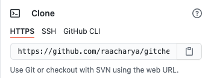
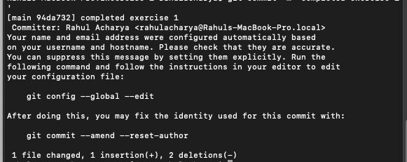

Welcome to the official Gitcheat interactive tutorial! While following the steps below, you will
obtain hands-on experience working with Git in a way that is representative of the situations you
will face on the real job. Enjoy!

**Section 1: Setup**

1. Fork this repo 
    a. The header of this repo should look like the picture below: 
         
    b. Click the Fork button at the top right of the screen. Then, select your Git
       username on the drop down.  
    c. At this point, you will have your own local copy of the repository! You can make
       changes as you please, **without** modifying the original repository.
2. Clone the forked repo 
    a. In this step, you are going to clone your forked repository so that you can make
       changes to it. Go to the code button shown below 
        
     b. Click the Code button, then copy the link under the "Clone with HTTPS" tab. 
          
     c. Go to your terminal, navigate to your desired workspace folder, and enter the
         following command: **git clone <cloneurl>**. If done correctly, you will see something resembling the following: 
         

At this point, you should have a copy of the Gitcheat repo in your local system. You can open
the repo folder in the IDE of your choice, modify files, and push to your forked repo!

**Section 2: Explore and Develop**

The repository you have cloned consists of multiple exercises. Each exercise is made up of 2
files - main.py and test.py. Each of the main.py files is a buggy program that fails for the test
cases in its corresponding test.py file. Your job is to fix the code and push your changes to the
repository. In this section, you will utilize various Git commands to explore the repository's structure and 
push your own code.

Before moving forward, do some exploration using various Git functions on the command line.

Answer the following questions:

1. How many commits have been made?
2. Who authored these commits?
3. What are the id numbers of each commit?

Now, we will walk through the first exercise in the repository. In this exercise, you will make a
code change and push it to your forked repository. First, check to see if the tests are working.
To do this, enter ​ **python3 test.py** ​on the command line. You should see that all the tests fail. 

Now, make your code change. You should see the following output before moving forward. 

Enter ​ **git status** ​ on the command line. You will see that you have modified main.py. 

Now, you must stage your changes to be committed. Use the **git add** command to do this. You
will see that your code change becomes green in the terminal. 

Next, commit your changes. Use **git commit -m “your message”** in the command line. If you
need help writing your commit message, check out the Gitcheat website.

As you can see from the terminal output above, your commit will have an author and a commit
id. It will tell you how many files you changed and what kinds of edits you made. 

Finally, push your changes to the repo using the **git push**. This will finalize your code change.
To verify that your push worked correctly, check to see if your commit showed up in the repository. You should see your commit listed with your commit message and code changes! 

Congratulations, you have now made your first code change using version control software! To
get more practice, complete the rest of the Gitcheat exercises and move on to create your own,
larger repositories. Check out the Gitcheat website for more version control help!

